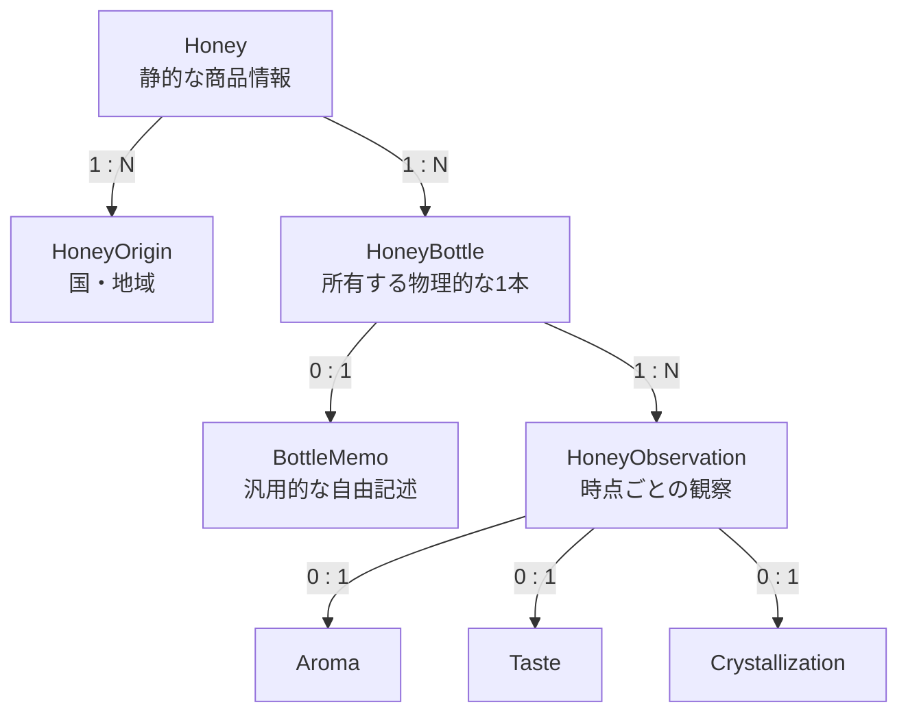

# Honey Note ドメインモデル再設計方針

## 1. このドキュメントの目的

このドキュメントは、Honey Note の蜂蜜詳細モデルを再設計するために、これまでに合意した内容を整理したものである。

次の開発工程で Codex に入力し、以下を作成するための前提資料として利用する。

- 既存モデルとの差分調査
- リファクタリング計画
- 実装タスクの分割
- データベース再設計
- Repository・UseCase・API・フロントエンドの移行計画

現段階ではドメインモデルの境界を決めることに注力する。データベースのテーブル定義、API仕様、移行コードの詳細は、このモデルを基に次工程で設計する。

## 2. 背景

現在の Honey Note では、蜂蜜に関する次の情報が一つのモデル周辺に集まっている。

- 商品としての蜂蜜の情報
- 採蜜年や購入日
- 購入した量や残量
- 色、香り、味、結晶化状態
- 自由記述のメモ
- 時点ごとの観察記録

また、Rust側には味・香り・観察記録などの型が存在する一方、データベースでは十分に永続化できていない。

同一商品を異なる年に購入したり、同じ年に同じ商品を複数本購入したりすることもある。そのため、「蜂蜜という商品」と「所有している物理的な1本」を同じEntityとして扱うと、責務が曖昧になる。

これを解消するため、ドメインを以下の単位に分離する。

1. `Honey`：静的な商品情報
2. `HoneyBottle`：ユーザーが所有する物理的な1本
3. `HoneyObservation`：ある時点におけるボトルの観察結果
4. `BottleMemo`：ボトルについての汎用的な自由記述

## 3. 基本方針

### 3.1 HoneyとBottleを分離する

`Honey`は商品・銘柄としての静的な情報を表す。

`HoneyBottle`は、ユーザーが実際に所有している物理的な1本を表す。

関係は以下とする。

```text
Honey 1 ── N HoneyBottle
```

例えば、同じ商品を同じ年に3本購入した場合でも、3つの`HoneyBottle`として識別する。

```text
Honey: ○○養蜂場 アカシア蜂蜜／北海道産
  ├─ Bottle 1: 2025年採蜜・2026年1月購入・300g
  ├─ Bottle 2: 2025年採蜜・2026年1月購入・300g
  └─ Bottle 3: 2026年採蜜・2026年10月購入・500g
```

### 3.2 ObservationはBottleに所属する

色、香り、味、結晶化状態などは、時間や保存状態によって変化する。

したがって、これらは`Honey`ではなく、特定の`HoneyBottle`に対する時点ごとの`HoneyObservation`として記録する。

```text
HoneyBottle 1 ── N HoneyObservation
```

### 3.3 所有者はBottleに所属する

所有者は商品ではなく、物理的なボトルに対して設定する。

```text
User 1 ── N HoneyBottle
```

`HoneyBottle`は`owner_id`を持つ。

`Honey`を将来ユーザー間で共有する商品マスターにするか、作成ユーザーごとの非共有データにするかは未決事項とする。

### 3.4 産地はHoneyに所属する

産地が異なる場合は、同じ名前・同じ養蜂家であっても別の`Honey`として扱う。

例えば、以下は別々の`Honey`である。

```text
○○養蜂場 百花蜜／北海道産
○○養蜂場 百花蜜／青森県産
```

一方、採蜜年や購入日が異なるだけで、商品・産地などが同一であれば、同じ`Honey`に属する別の`HoneyBottle`として扱う。

## 4. モデルの関係



## 5. Honey

### 5.1 責務

`Honey`は、商品・銘柄としての蜂蜜を表すEntityである。

次のような、基本的に購入ごとには変化しない情報を持つ。

- 商品名
- 養蜂家
- 蜂蜜の種類
- 蜜源
- 産地
- 作成日時・更新日時

### 5.2 持たせない情報

以下は`Honey`には持たせない。

- 採蜜年
- 購入日
- 購入量
- 残量
- ロット番号
- 開封日
- 消費完了日
- 味・香り・結晶化状態
- 所有者
- ボトル固有のメモ

### 5.3 Rustモデル案

```rust
pub struct Honey {
    pub id: HoneyId,
    pub name: HoneyName,
    pub beekeeper_id: Option<BeekeeperId>,
    pub honey_type: Option<HoneyType>,
    pub flower_ids: Vec<FlowerId>,
    pub origins: Vec<HoneyOrigin>,
    pub created_at: DateTime<FixedOffset>,
    pub updated_at: DateTime<FixedOffset>,
}
```

このコードは概念を示す案であり、既存コードとの整合を確認したうえで最終決定する。

## 6. HoneyOrigin

### 6.1 基本方針

産地は`Honey`に所属する。

国はCountry Codeで構造化し、国の内部の地域は自由記述の`OriginArea`として表現する。

Country CodeにはISO 3166-1 alpha-2形式の利用を想定する。

```rust
pub struct HoneyOrigin {
    pub country_code: CountryCode,
    pub areas: Vec<OriginArea>,
}

pub struct OriginArea {
    pub name: String,
}
```

### 6.2 複数産地

`Honey`は複数の`HoneyOrigin`を持てる。

これにより以下を表現できる。

- 単一国・単一地域
- 単一国・複数地域
- 複数国・複数地域
- 国だけが分かっている
- 産地不明

単一国・複数地域の例：

```rust
vec![
    HoneyOrigin {
        country_code: CountryCode::new("JP")?,
        areas: vec![
            OriginArea::new("北海道")?,
            OriginArea::new("青森県")?,
        ],
    },
]
```

複数国の例：

```rust
vec![
    HoneyOrigin {
        country_code: CountryCode::new("JP")?,
        areas: vec![OriginArea::new("長野県")?],
    },
    HoneyOrigin {
        country_code: CountryCode::new("NZ")?,
        areas: vec![OriginArea::new("ワイカト地方")?],
    },
]
```

産地不明は空のリストで表現する。

```rust
origins: vec![]
```

国だけが分かっている場合は、`areas`を空にする。

```rust
HoneyOrigin {
    country_code: CountryCode::new("JP")?,
    areas: vec![],
}
```

### 6.3 Prefectureの扱い

日本の都道府県だけに限定すると、「信州」「九州」「十勝地方」などの行政区分ではない産地を表現しにくい。

そのため、ドメインモデルの中心は自由記述の`OriginArea`とする。

既存のPrefectureマスターは、将来の入力支援として利用できる。

- 都道府県候補の表示
- 複数選択
- 選択値から`OriginArea`への変換
- マスターに存在しない地域の自由入力

## 7. HoneyBottle

### 7.1 責務

`HoneyBottle`は、ユーザーが所有する物理的な1本を表すEntityである。

次のような、購入したボトルごとに異なる情報を持つ。

- 対応するHoney
- 所有者
- 採蜜年
- 購入日
- 初期量
- 残量
- ロット番号
- 開封日
- 消費完了日
- 作成日時・更新日時

### 7.2 Rustモデル案

```rust
pub struct HoneyBottle {
    pub id: HoneyBottleId,
    pub honey_id: HoneyId,
    pub owner_id: UserId,

    pub harvest_year: Option<HarvestYear>,
    pub purchased_at: Option<DateTime<FixedOffset>>,
    pub initial_amount: Option<Gram>,
    pub remaining_amount: Option<Gram>,
    pub lot_number: Option<LotNumber>,

    pub opened_at: Option<DateTime<FixedOffset>>,
    pub finished_at: Option<DateTime<FixedOffset>>,

    pub created_at: DateTime<FixedOffset>,
    pub updated_at: DateTime<FixedOffset>,
}
```

### 7.3 HoneyLotは現段階では導入しない

採蜜年やロット番号は、厳密にはBottleではなく製造ロットの属性である可能性がある。

しかし、現段階で以下の4階層にすると構造が重くなる。

```text
Honey → HoneyLot → HoneyBottle → HoneyObservation
```

まずは採蜜年とロット番号を`HoneyBottle`に持たせる。

将来、同一ロットの複数ボトルをまとめて管理する要求が具体化した場合に、`HoneyLot`の導入を検討する。

## 8. HoneyObservation

### 8.1 責務

`HoneyObservation`は、特定の`HoneyBottle`をある時点で観察した結果を表すEntityである。

同じBottleに対して複数のObservationを追加できる。

```text
HoneyBottle 1 ── N HoneyObservation
```

主な情報は以下である。

- 観察日時（秒まで。同日でも複数回記録可能）
- 色
- 香り
- 味
- 結晶化状態
- 水分量
- 好み・評価
- 自由記述メモ
- 作成日時・更新日時

### 8.2 Rustモデル案

```rust
pub struct HoneyObservation {
    pub id: HoneyObservationId,
    pub bottle_id: HoneyBottleId,
    pub observed_at: DateTime<FixedOffset>,

    pub color: Option<ColorFeature>,
    pub aroma: Option<Aroma>,
    pub taste: Option<Taste>,
    pub crystallization: Option<Crystallization>,
    pub moisture_percent: Option<MoisturePercent>,
    pub preference: Option<Rating>,
    pub memo: Option<MemoContent>,

    pub created_at: DateTime<FixedOffset>,
    pub updated_at: DateTime<FixedOffset>,
}
```

現在の`HoneyDetailDynamic`は、責務が確定した段階で`HoneyObservation`へ置き換える方向とする。

## 9. Aroma・Taste・Crystallization

Observationに多数のフィールドを平坦に並べるのではなく、意味のまとまりごとにValue Objectへ分離する。

### 9.1 Aroma

```rust
pub struct Aroma {
    pub intensity: Option<AromaIntensity>,
    pub aroma_type: Option<AromaType>,
    pub note: Option<AromaNote>,
}
```

`AromaType`をEnumにする場合は、既知の分類だけに入力を制限しすぎないよう、`Other(String)`または自由記述を許容することを検討する。

```rust
pub enum AromaType {
    Floral,
    Fruity,
    Herbal,
    Woody,
    Spicy,
    Caramel,
    Fermented,
    Other(String),
}
```

分類がまだ安定していない場合は、最初は文字列として扱ってもよい。

### 9.2 Taste

```rust
pub struct Taste {
    pub sweetness: Option<SweetnessIntensity>,
    pub acidity: Option<Acidity>,
    pub bitterness: Option<Bitterness>,
    pub mouthfeel: Option<Mouthfeel>,
    pub finish: Option<Finish>,
    pub note: Option<TasteNote>,
}
```

`bitterness`は現在のモデルとの差分を確認し、追加するかを決定する。

`mouthfeel`や`finish`も、分類が固まるまでは自由記述または`Other(String)`を許容する。

### 9.3 Crystallization

```rust
pub struct Crystallization {
    pub level: Option<CrystallizationLevel>,
    pub texture: Option<CrystalTexture>,
}
```

構造化できない微妙な状態は、Observationの`memo`またはBottleMemoに文章として記録する。

例：

```text
全体的に白く結晶化しているが、口当たりは非常にクリーミー。
完全に固形化したわけではなく、液体部分もほどほどに残っている。
```

Rustモデル上でValue Objectに分離することと、データベース上で別テーブルに分離することは別の判断である。DB設計時に、検索条件、更新単位、NULLの扱いなどを基に決定する。

## 10. BottleMemo

### 10.1 基本方針

`BottleMemo`は、Bottleについての汎用的な自由記述を表す独立Entityとする。

現段階では以下の関係とする。

```text
HoneyBottle 1 ── 0..1 BottleMemo
```

1つのBottleに対して、最大1つの更新可能なMemoを持つ。

### 10.2 想定する内容

用途は限定しない。

- テイスティング時の感想
- 構造化パラメーターでは表現できない結晶化状態
- 色、粘度、液体部分の残り具合
- 保存状態
- 養蜂家から聞いた話
- 購入時の出来事
- 食べ方や料理との組み合わせ
- 次回確認したいこと

### 10.3 Rustモデル案

独立Entityであるため、`BottleMemoId`を持たせる。

```rust
#[derive(Debug, Clone, Copy, PartialEq, Eq, Hash)]
pub struct BottleMemoId(i64);

#[derive(Debug, Clone, PartialEq, Eq)]
pub struct MemoContent(String);

#[derive(Debug, Clone, PartialEq, Eq)]
pub struct BottleMemo {
    pub id: BottleMemoId,
    pub bottle_id: HoneyBottleId,
    pub content: MemoContent,
    pub created_at: DateTime<FixedOffset>,
    pub updated_at: DateTime<FixedOffset>,
}
```

新規作成時には永続化済みEntityと入力を分ける。

```rust
#[derive(Debug, Clone, PartialEq, Eq)]
pub struct NewBottleMemo {
    pub bottle_id: HoneyBottleId,
    pub content: MemoContent,
}
```

`HoneyBottle`側に`memo_id`は持たせず、`BottleMemo`が`bottle_id`を持つ。

DB設計時には、`bottle_id`への一意制約によって1対0..1を保証する案を検討する。

### 10.4 Observationのmemoとの関係

`BottleMemo`と`HoneyObservation.memo`の用途をシステム上で厳密に制限しない。

どちらに記録するかはユーザーの判断に委ねる。

目安としては以下のように説明できる。

- BottleMemo：ボトル全体について残しておきたい文章
- Observation.memo：特定時点の観察結果についての文章

ただし、入力内容の重複や書き分けをバリデーションで禁止しない。

### 10.5 将来のブログ・履歴形式

現段階では、ブログ形式や追記型の履歴機能は導入しない。

将来必要になった場合は、以下のような1対多のEntityへ移行できる。

```rust
pub struct BottleJournalEntry {
    pub id: BottleJournalEntryId,
    pub bottle_id: HoneyBottleId,
    pub title: Option<String>,
    pub content: MemoContent,
    pub recorded_at: DateTime<FixedOffset>,
    pub created_at: DateTime<FixedOffset>,
    pub updated_at: DateTime<FixedOffset>,
}
```

```text
HoneyBottle 1 ── N BottleJournalEntry
```

既存のBottleMemoは、移行時に最初のJournal Entryへ変換できる。

ただし、更新によって上書きされた過去の内容は復元できない。この点はMVP段階のトレードオフとして受け入れる。

## 11. 合成モデル

Entityは分離するが、詳細画面や取得UseCaseで一緒に扱うための合成モデルを用意できる。

```rust
pub struct HoneyBottleDetail {
    pub bottle: HoneyBottle,
    pub memo: Option<BottleMemo>,
    pub observations: Vec<HoneyObservation>,
}
```

`HoneyBottleDetail`自体は新しいEntityではない。複数のEntityをまとめて返すための読み取り用またはUseCase出力用のモデルである。

## 12. IDとValue Object

異なるEntityのIDを取り違えないよう、それぞれnewtypeを定義する方向とする。

```rust
pub struct HoneyId(i64);
pub struct HoneyBottleId(i64);
pub struct HoneyObservationId(i64);
pub struct BottleMemoId(i64);
pub struct BeekeeperId(i64);
pub struct FlowerId(i64);
pub struct UserId(i64);
```

単位や制約を持つ値についてもValue Object化を検討する。

```rust
pub struct Gram(f64);
pub struct HarvestYear(i32);
pub struct CountryCode(String);
pub struct Rating(u8);
pub struct MoisturePercent(f64);
```

例えばRatingを1から5に制限する場合、生成時に検証する。

```rust
impl Rating {
    pub fn new(value: u8) -> Result<Self, DomainError> {
        if (1..=5).contains(&value) {
            Ok(Self(value))
        } else {
            Err(DomainError::InvalidRating(value))
        }
    }
}
```

香り、甘さ、酸味などについては、内部で共通のRatingを使いつつ、意味ごとのnewtypeを維持する案を検討する。

## 13. 新規作成モデルと永続化済みEntity

永続化前の値を、`id: Option<_>`や`created_at: Option<_>`を持つEntityとして表現しない方向を推奨する。

例えば以下を分ける。

```rust
pub struct NewHoneyBottle {
    pub honey_id: HoneyId,
    pub owner_id: UserId,
    pub harvest_year: Option<HarvestYear>,
    pub purchased_at: Option<DateTime<FixedOffset>>,
    pub initial_amount: Option<Gram>,
    pub lot_number: Option<LotNumber>,
}

pub struct HoneyBottle {
    pub id: HoneyBottleId,
    // 省略
    pub created_at: DateTime<FixedOffset>,
    pub updated_at: DateTime<FixedOffset>,
}
```

同様に、必要に応じて以下を定義する。

- `NewHoney`
- `NewHoneyBottle`
- `NewHoneyObservation`
- `NewBottleMemo`

## 14. 今回のスコープ

最初の工程では、モデルの再設計に注力する。

### 対象

- `Honey`の静的商品モデルへの再定義
- `HoneyBottle`の新設
- `HoneyObservation`の定義
- `BottleMemo`の定義
- `HoneyOrigin`と`OriginArea`の定義
- `Aroma`、`Taste`、`Crystallization`のValue Object化
- EntityごとのID型の定義
- 新規作成モデルと永続化済みEntityの分離方針
- 既存モデルとの差分整理

### 現段階では対象外

- DBマイグレーションの実装
- Repositoryの実装変更
- APIエンドポイントの変更
- フロントエンドの変更
- 既存データの移行
- BottleMemoのブログ形式化
- `HoneyLot`の導入

## 15. 実装時の進め方

モデルだけを先に変更して既存RepositoryやAPIを一斉に壊すのではなく、まず新モデルを既存モデルとは独立して定義し、差分と移行順序を明確にする。

推奨する初期作業は以下である。

1. 現在の`common-type`配下のモデルを調査する
2. 既存型を「残す・改名する・置き換える・削除候補」に分類する
3. 新しいドメインモデルのモジュール構成を提案する
4. EntityとValue Objectの不変条件を列挙する
5. 新モデル単体のテストを作成する
6. 既存Request・Repository・UseCaseへの影響範囲を調査する
7. DB再設計を含む段階的な移行計画を作成する

今回のリファクタリング全体を1つのブランチで扱うことは可能だが、巨大な1コミットにはしない。

モデル、DB、Repository、UseCase、API、フロントエンドなどの責務単位でコミットを分割する。

## 16. Codexに依頼する次の作業

この文書を入力として、まず以下を依頼する。

```text
Honey Noteの現行mainブランチを調査し、この設計方針と現在のcommon-type配下のモデルを比較してください。

まだコードは変更せず、以下を作成してください。

1. 現在のモデル構造
2. 新モデルとの対応表
3. 残す型
4. 改名する型
5. 新設する型
6. 削除候補の型
7. 各型を配置する推奨モジュール構成
8. 影響を受けるRepository・UseCase・Controller・フロントエンド・バッチ
9. コンパイル可能な状態を保つための実装順序
10. 未決事項と、実装前に確認が必要な点

推測で仕様を確定せず、不明点は未決事項として明示してください。
```

## 17. 未決事項

以下は、現段階では確定していない。

### 17.1 Honeyの共有範囲

- Honeyを全ユーザー共通の商品マスターにするか
- Honeyにも作成者・所有者を持たせ、ユーザーごとに分離するか

所有者がBottleに所属することは確定しているが、Honeyの可視範囲と編集権限は別途決定する必要がある。

### 17.2 分類型の表現

以下をEnumにするか、自由記述にするか、既知値＋`Other(String)`にするかは未決定である。

- `AromaType`
- `Mouthfeel`
- `Finish`
- `CrystalTexture`
- `HoneyType`

実際の登録データや検索要件を確認して決定する。

### 17.3 評価尺度

以下の尺度を1〜5とするかは未確定である。

- 香りの強さ
- 甘さ
- 酸味
- 苦味
- 結晶化レベル
- 好み

### 17.4 Bitterness

`Taste`に苦味を追加する案があるが、現行モデルとの比較後に決定する。

### 17.5 日付と日時

2026-09-18の回答により、購入日・開封日・消費完了日は日付、観察は秒までの日時とする。同日の複数観察を保持する。観察IDで一意に識別し、同一ボトル・同一秒の登録も許容する。不要な観察はdeleted_atによる論理削除とする。

### 17.6 内容量の単位

初期量と残量をグラムに統一する案を想定しているが、mlなど他単位の必要性を確認する。

### 17.7 BottleMemoの記法

内容は通常の文字列として保存する。

将来的にMarkdownとして表示する可能性はあるが、現段階では表示仕様やサニタイズ方法を確定しない。

## 18. 確定事項の要約

| 項目 | 決定内容 |
| --- | --- |
| Honey | 商品・銘柄としての静的情報を持つ |
| HoneyとBottle | 1対多 |
| HoneyBottle | 所有する物理的な1本を表す |
| 所有者 | Bottleに所属する |
| 採蜜年 | Bottleに所属する |
| 購入日・容量・残量 | Bottleに所属する |
| 産地 | Honeyに所属する |
| 産地が異なる場合 | 別のHoneyとして扱う |
| Country | Country Codeで構造化する |
| Area | 自由記述で複数保持できる |
| Observation | Bottleに所属し、複数回記録できる |
| Aroma | Observation内のValue Objectとして分離する |
| Taste | Observation内のValue Objectとして分離する |
| Crystallization | Observation内のValue Objectとして分離する |
| BottleMemo | Rust上の独立Entityとして定義する |
| BottleとBottleMemo | 1対0..1 |
| BottleMemoの更新 | ひとまず単一メモを更新する方式 |
| Observation.memo | 保持する |
| 2種類のメモの書き分け | ユーザーの判断に委ね、システムでは強制しない |
| ブログ形式 | 将来候補。現在は導入しない |
| HoneyLot | 現段階では導入しない |
| BC | 現在は安定稼働中のDBがないため、後方互換性を必須としない |

